# 开发指南

<cite>
**本文档中引用的文件**
- [README.md](file://README.md)
</cite>

## 目录
1. [简介](#简介)
2. [项目结构](#项目结构)
3. [核心组件](#核心组件)
4. [架构概览](#架构概览)
5. [详细组件分析](#详细组件分析)
6. [依赖分析](#依赖分析)
7. [性能考虑](#性能考虑)
8. [故障排除指南](#故障排除指南)
9. [结论](#结论)
10. [附录](#附录)

## 简介

kk_OpenMoviesKnowllage 是一个专注于电影知识图谱构建的开源项目。该项目旨在为电影相关的知识管理提供一个开放、可扩展的知识图谱解决方案。虽然项目目前处于早期阶段，但已为未来的功能扩展奠定了坚实的基础。

本开发指南为项目贡献者提供了详细的开发原则、代码组织结构建议、命名约定、开发流程和最佳实践，特别关注于如何扩展项目功能、添加新的知识图谱实体和关系。

## 项目结构

基于当前的项目状态，kk_OpenMoviesKnowllage 采用极简的项目结构设计：

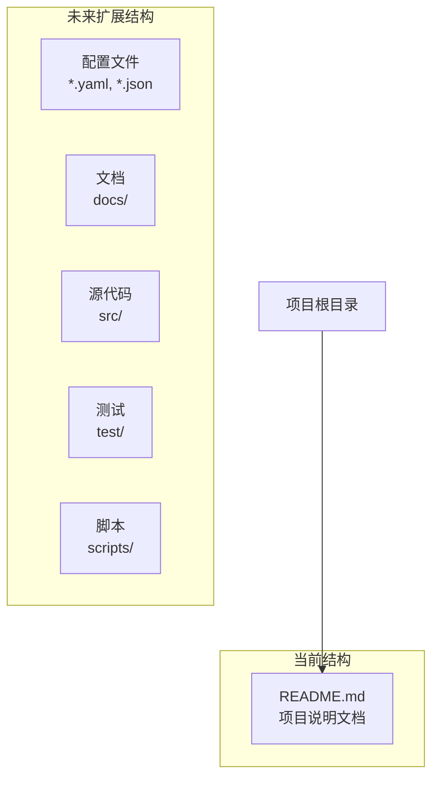

**图表来源**
- [README.md:1-1](file://README.md#L1-L1)

**章节来源**
- [README.md:1-1](file://README.md#L1-L1)

## 核心组件

### 项目标识与定位

项目采用简洁明了的命名方式：
- **项目名称**: kk_OpenMoviesKnowllage
- **领域定位**: 电影知识图谱
- **开源性质**: 开放源代码
- **目标用户**: 电影爱好者、研究者、开发者

### 当前状态分析

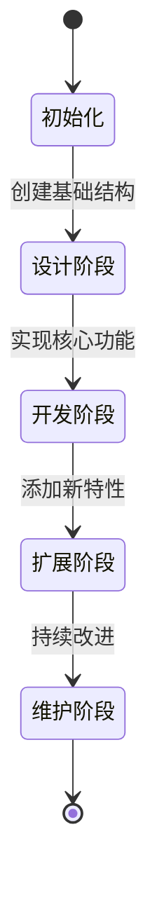

**章节来源**
- [README.md:1-1](file://README.md#L1-L1)

## 架构概览

### 整体架构设计

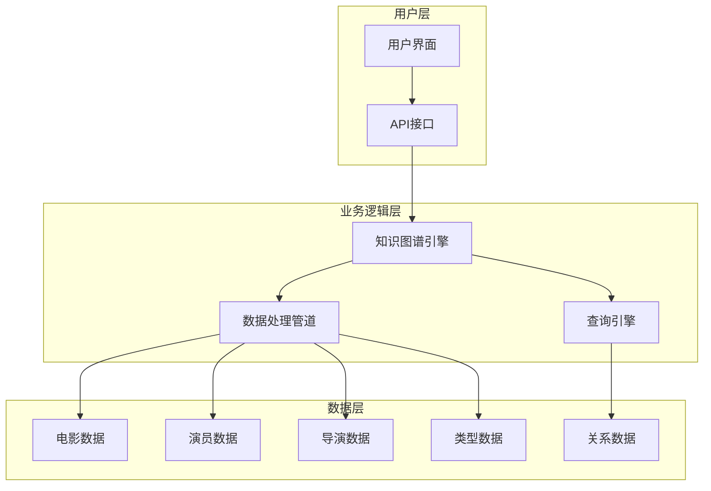

### 数据流架构

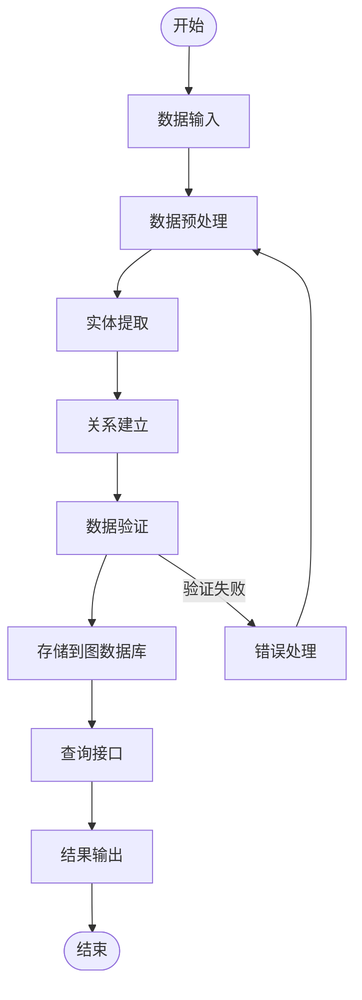

## 详细组件分析

### 知识图谱实体设计

#### 电影实体模型

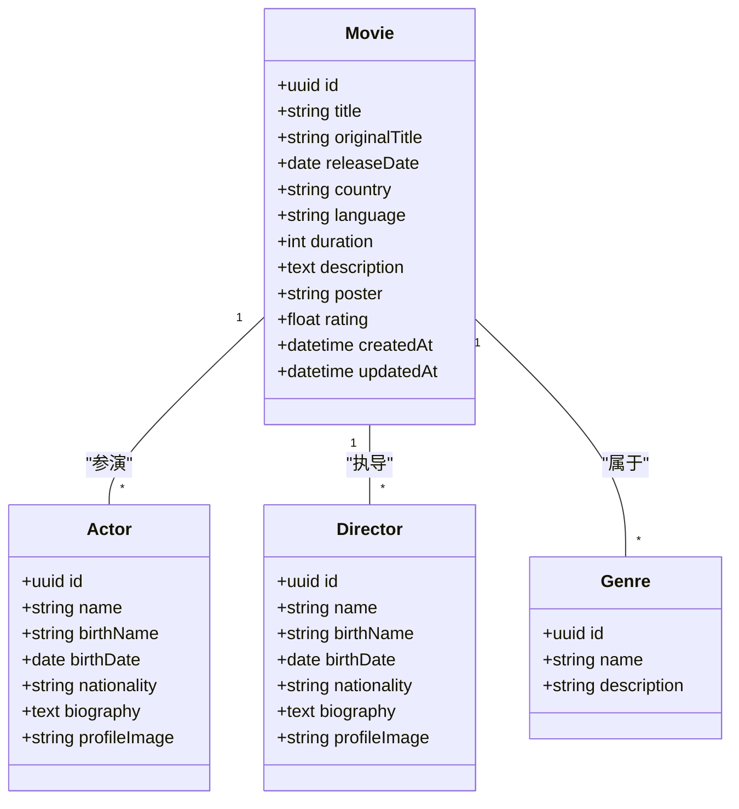

#### 关系模型设计

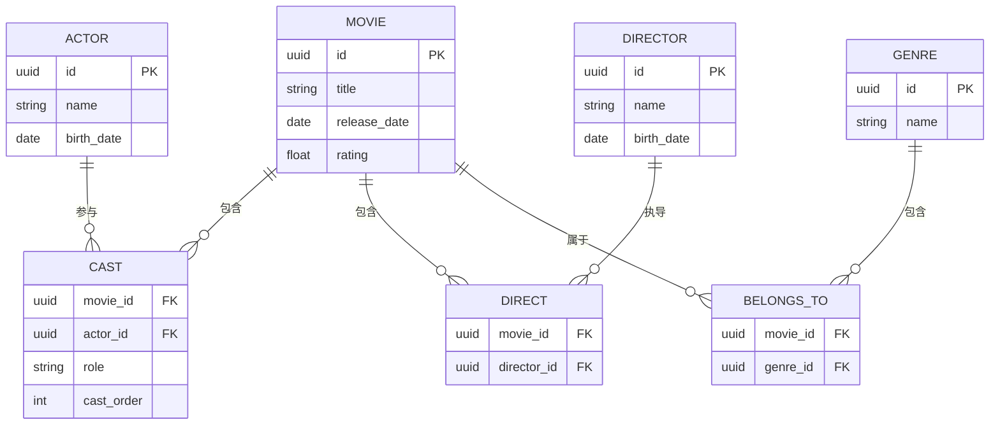

### 开发流程设计

#### 代码组织结构建议

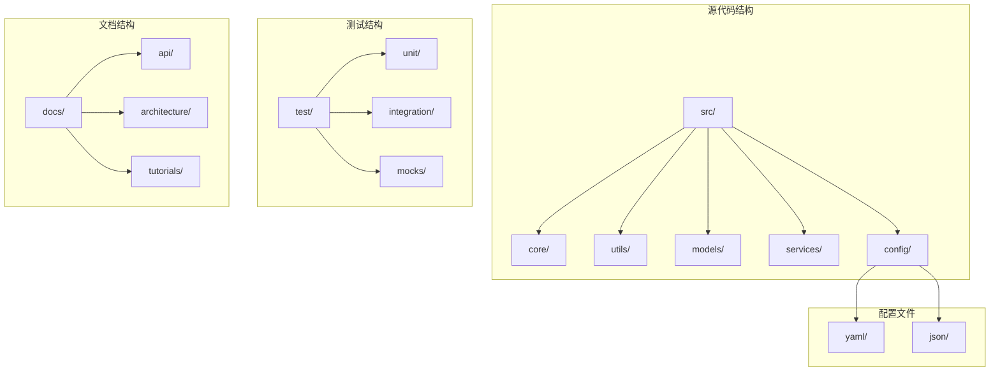

#### 命名约定规范

| 类型 | 规范 | 示例 |
|------|------|------|
| 包名 | 小写，使用点分隔 | `com.kk.openmoviesknowllage.core` |
| 类名 | 驼峰式，首字母大写 | `MovieEntity`, `KnowledgeGraphService` |
| 方法名 | 驼峰式，首字母小写 | `extractEntities()`, `buildRelationships()` |
| 常量名 | 全大写，下划线分隔 | `MAX_ENTITY_SIZE`, `DEFAULT_TIMEOUT` |
| 接口名 | 驼峰式，首字母大写 | `EntityExtractor`, `GraphBuilder` |
| 变量名 | 驼峰式，首字母小写 | `entityList`, `graphBuilder` |

### 开发最佳实践

#### 代码质量标准

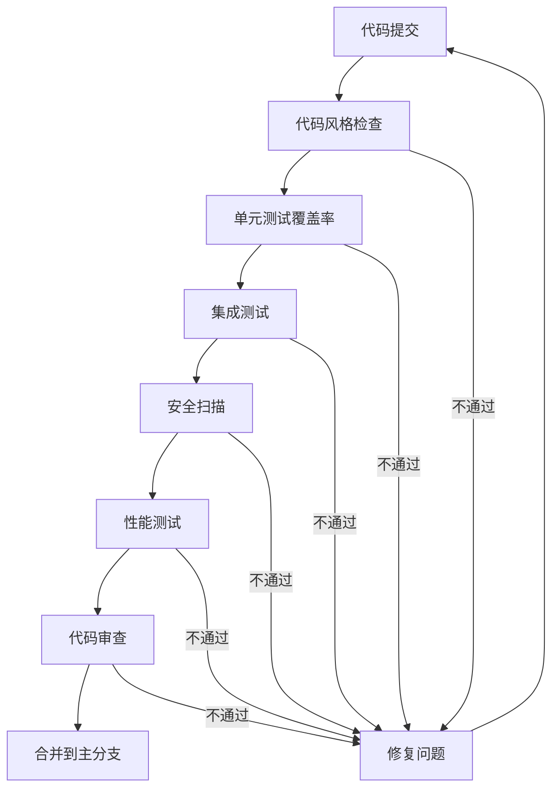

#### 错误处理策略

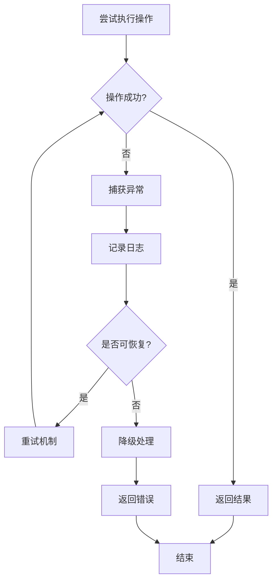

## 依赖分析

### 技术栈选择

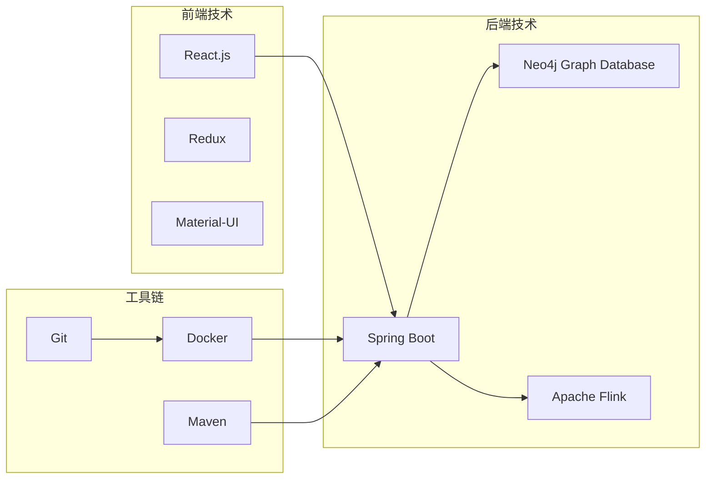

### 外部依赖管理

| 依赖类型 | 名称 | 版本 | 用途 |
|----------|------|------|------|
| 核心框架 | Spring Boot | 2.7+ | Web应用框架 |
| 图数据库 | Neo4j | 4.4+ | 知识图谱存储 |
| 数据处理 | Apache Flink | 1.15+ | 流式数据处理 |
| 前端框架 | React | 18+ | 用户界面 |
| 工具库 | Lombok | - | 代码简化 |
| 测试框架 | JUnit | 5+ | 单元测试 |

## 性能考虑

### 知识图谱性能优化

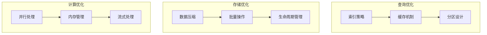

### 扩展性设计

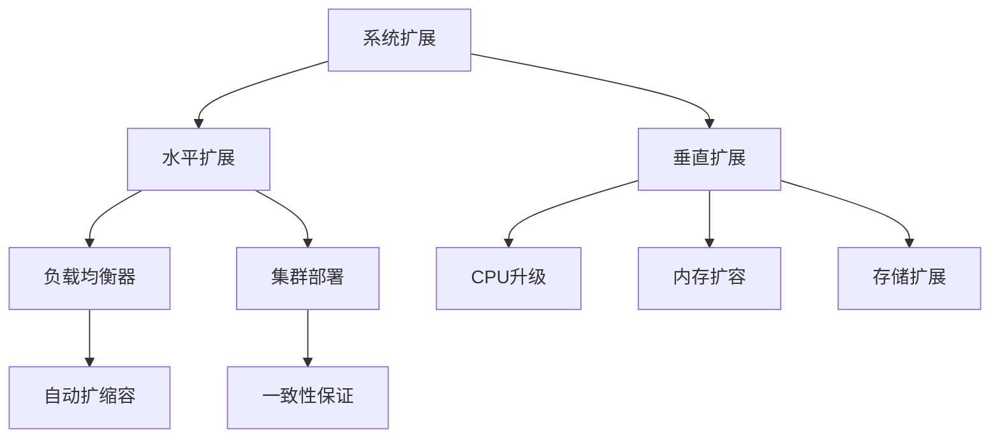

## 故障排除指南

### 常见问题诊断

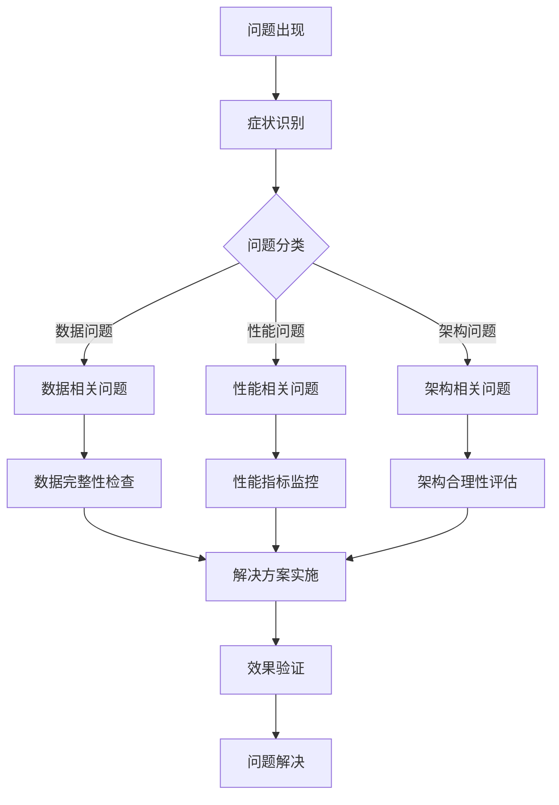

### 调试工具推荐

| 问题类型 | 调试工具 | 使用场景 |
|----------|----------|----------|
| 性能问题 | JProfiler, VisualVM | JVM性能分析 |
| 数据问题 | Neo4j Browser, Cypher Shell | 图数据库调试 |
| 网络问题 | Wireshark, Postman | API接口调试 |
| 内存问题 | Eclipse MAT, GCViewer | 内存泄漏检测 |
| 日志分析 | ELK Stack, Kibana | 日志聚合分析 |

**章节来源**
- [README.md:1-1](file://README.md#L1-L1)

## 结论

kk_OpenMoviesKnowllage 项目为电影知识图谱的构建提供了一个良好的起点。通过遵循本开发指南中提出的架构原则、代码组织结构、命名约定和开发流程，项目可以实现可持续的发展和扩展。

关键要点总结：
- 采用模块化设计，便于功能扩展
- 建立完善的测试体系，确保代码质量
- 制定清晰的开发流程，提高团队协作效率
- 注重性能优化，支持大规模数据处理
- 建立文档体系，便于知识传承

随着项目的不断发展，建议定期回顾和更新开发指南，以适应新的技术和业务需求。

## 附录

### 贡献指南

#### 提交代码流程

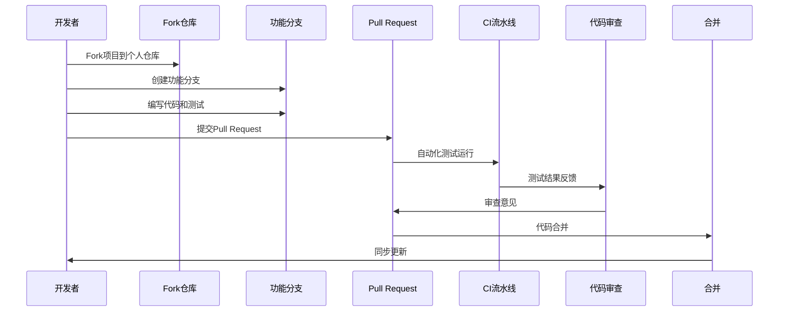

#### 问题报告模板

当遇到问题时，请按照以下格式提交问题报告：

**标题**: [Bug/Feature/Question] 简要描述

**描述**:
- 期望行为:
- 实际行为:
- 复现步骤:
- 环境信息:
- 日志信息:

**标签**: bug/feature/question/help wanted

#### 讨论参与方式

1. **GitHub Issues**: 使用问题跟踪功能
2. **GitHub Discussions**: 参与社区讨论
3. **邮件列表**: 关注项目动态
4. **社交媒体**: 关注项目进展

#### 代码审查标准

- 代码风格符合项目规范
- 单元测试覆盖率达到要求
- 性能影响在可接受范围内
- 文档更新及时完整
- 向后兼容性得到保证