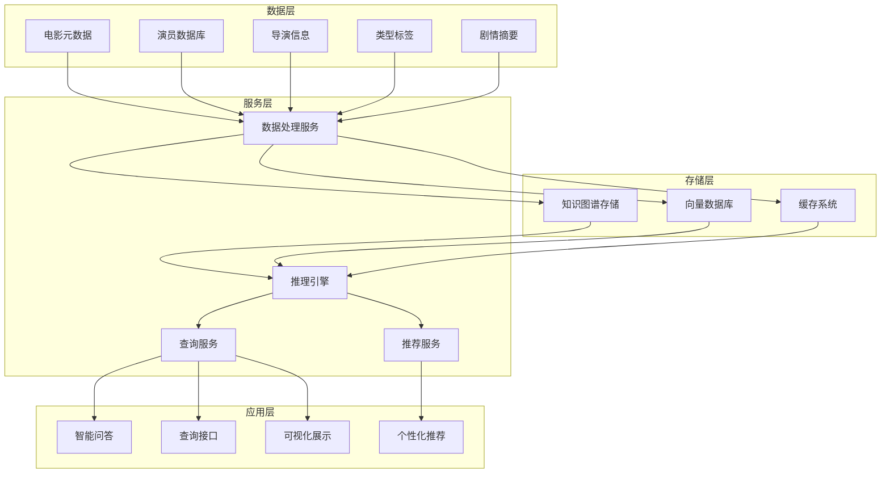
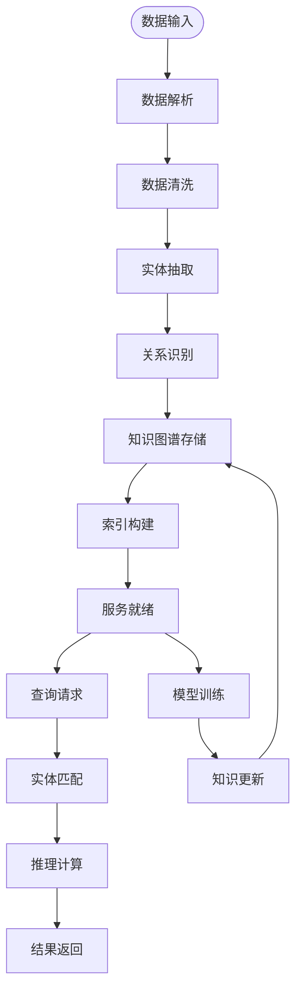
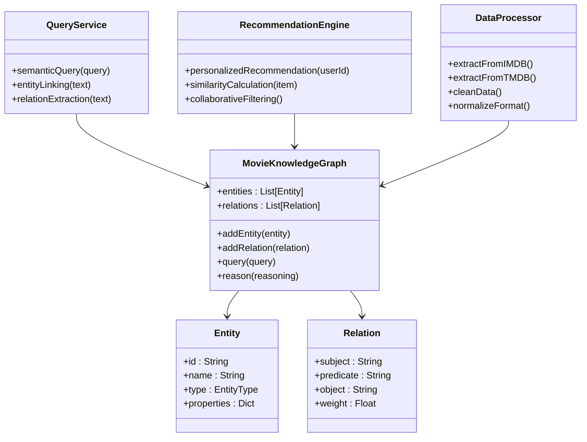
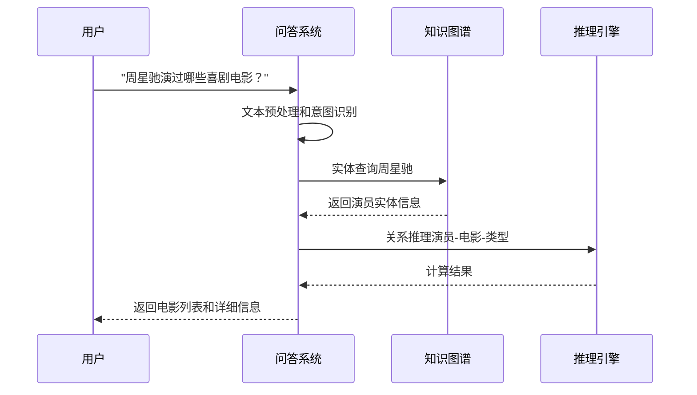
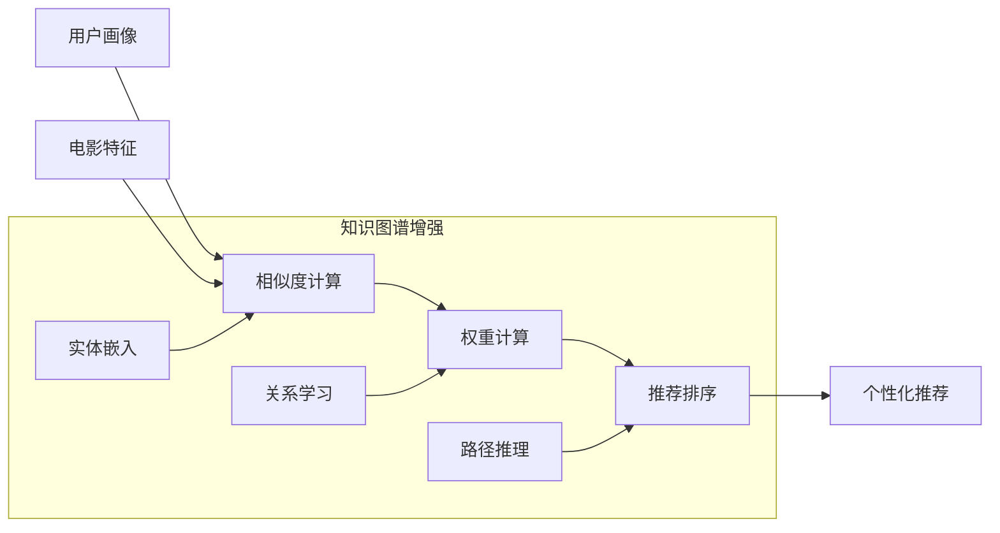

# 项目概述

<cite>
**本文档引用的文件**
- [README.md](file://README.md)
</cite>

## 目录
1. [项目简介](#项目简介)
2. [核心目标与愿景](#核心目标与愿景)
3. [项目现状分析](#项目现状分析)
4. [技术架构思路](#技术架构思路)
5. [预期功能模块](#预期功能模块)
6. [发展路线图](#发展路线图)
7. [知识图谱应用价值](#知识图谱应用价值)
8. [项目背景与动机](#项目背景与动机)
9. [面向不同用户群体的指导](#面向不同用户群体的指导)
10. [结论](#结论)

## 项目简介

kk_OpenMoviesKnowllage 是一个专注于电影领域的开放知识图谱项目。该项目旨在构建一个全面的电影知识网络，通过结构化的数据关系来连接电影、演员、导演、类型、剧情等各个方面的信息，为智能问答、推荐系统和查询服务提供强大的语义支持。

**章节来源**
- [README.md:1-1](file://README.md#L1-L1)

## 核心目标与愿景

### 核心目标
- 构建完整的电影知识图谱，涵盖电影产业的各个方面
- 提供智能化的电影信息查询和推荐能力
- 建立开放的电影知识共享平台
- 推动电影领域人工智能应用的发展

### 愿景
成为电影行业最权威、最全面的知识图谱平台，为电影爱好者、从业者和研究者提供一站式的信息服务。

## 项目现状分析

### 当前状态
根据现有仓库内容，项目目前处于初始阶段：
- 仅包含基础的项目名称文件
- 缺少核心代码实现
- 未包含数据集和配置文件
- 无详细的文档说明

### 技术栈准备
从项目命名可以看出，预期将采用以下技术方向：
- Python作为主要开发语言
- 知识图谱技术栈
- 机器学习和自然语言处理
- Web服务框架

**章节来源**
- [README.md:1-1](file://README.md#L1-L1)

## 技术架构思路

### 整体架构设计

### 数据流架构

## 预期功能模块

### 核心功能模块

### 辅助功能模块

| 模块名称 | 功能描述 | 技术实现 |
|---------|----------|----------|
| 数据采集模块 | 从多个电影数据库抓取数据 | 爬虫技术、API调用 |
| 实体消歧模块 | 解决同名实体的歧义问题 | NLP算法、相似度计算 |
| 关系抽取模块 | 自动识别实体间的关系 | 机器学习、规则引擎 |
| 推理引擎模块 | 基于规则的逻辑推理 | 专家系统、OWL推理 |
| 查询优化模块 | 提升查询性能和准确性 | 向量检索、索引优化 |

## 发展路线图

### 第一阶段：基础建设（1-3个月）
- 完成项目基础设施搭建
- 建立数据采集和处理流程
- 构建基础的知识图谱结构
- 开发核心查询功能

### 第二阶段：功能完善（4-6个月）
- 扩展实体类型和关系覆盖
- 实现智能问答功能
- 开发个性化推荐系统
- 优化查询性能

### 第三阶段：生态建设（7-12个月）
- 建立开放API接口
- 开发Web前端界面
- 构建社区贡献机制
- 推广和应用落地

### 第四阶段：智能化升级（12+个月）
- 集成深度学习技术
- 实现多模态信息处理
- 开发移动端应用
- 建立商业化模式

## 知识图谱应用价值

### 在智能问答中的应用

### 在推荐系统中的应用

### 在查询服务中的应用

| 应用场景 | 查询类型 | 技术特点 | 性能优势 |
|---------|----------|----------|----------|
| 电影搜索 | 结构化查询 | 精确匹配 | 快速响应 |
| 演员查询 | 实体链接 | 语义理解 | 准确性高 |
| 类型筛选 | 关系查询 | 多跳推理 | 覆盖面广 |
| 时间范围查询 | 时间序列 | 时序分析 | 精准定位 |

## 项目背景与动机

### 电影行业数字化转型需求
- 传统搜索引擎难以满足复杂的电影查询需求
- 人工标注成本高，覆盖面有限
- 缺乏统一的电影信息标准和格式

### 知识图谱技术优势
- **结构化表示**：以三元组形式表达实体关系
- **语义推理**：支持基于规则的逻辑推断
- **可解释性强**：推理过程透明可追踪
- **扩展性好**：易于添加新的实体和关系

### 技术发展趋势
- 人工智能在娱乐领域的应用快速增长
- 用户对个性化服务的需求不断提升
- 开放数据和知识共享的理念兴起

## 面向不同用户群体的指导

### 初学者入门指南

#### 知识图谱基础概念
- **实体（Entity）**：现实世界中的对象，如电影、演员、导演
- **关系（Relation）**：实体之间的关联，如"主演"、"导演"、"类型"
- **属性（Attribute）**：实体的特征，如上映时间、评分、时长
- **三元组**：由主体-谓词-客体组成的最小知识单元

#### 学习路径建议
1. 从简单的实体识别开始
2. 学习基本的关系抽取
3. 掌握查询语言（SPARQL）
4. 了解推理算法
5. 实践项目开发

### 开发者技术深度

#### 核心技术栈
- **Python生态系统**：NetworkX、rdflib、spaCy
- **数据库技术**：Neo4j、Apache Jena、Apache Flick
- **机器学习**：OpenKE、Gensim、Transformers
- **Web框架**：FastAPI、Flask、Django

#### 性能优化策略
- **索引优化**：建立多级索引提高查询效率
- **缓存策略**：热点数据缓存减少重复计算
- **并行处理**：利用多核CPU提升处理速度
- **内存管理**：合理控制内存使用避免溢出

## 结论

kk_OpenMoviesKnowllage项目代表了电影行业数字化转型的重要方向。虽然当前项目还处于起步阶段，但其技术架构设计合理，应用场景明确，具有巨大的发展潜力。

### 项目优势
- **技术前瞻性**：采用前沿的知识图谱技术
- **应用价值高**：直接服务于电影爱好者和从业者
- **开源生态**：符合现代软件开发趋势
- **扩展性强**：可适应未来技术发展

### 发展建议
1. 尽快完善数据采集和处理流程
2. 建立标准化的数据格式和接口规范
3. 加强社区建设和用户反馈收集
4. 注重性能优化和用户体验提升

该项目有望成为电影领域知识图谱应用的标杆项目，为相关技术的发展和应用推广做出重要贡献。